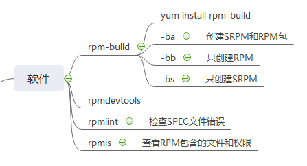
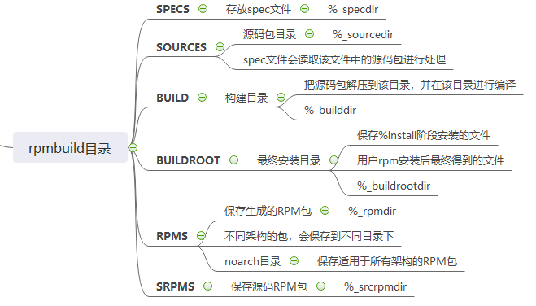
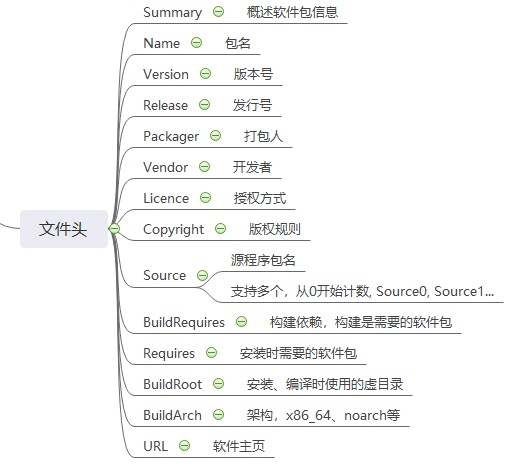
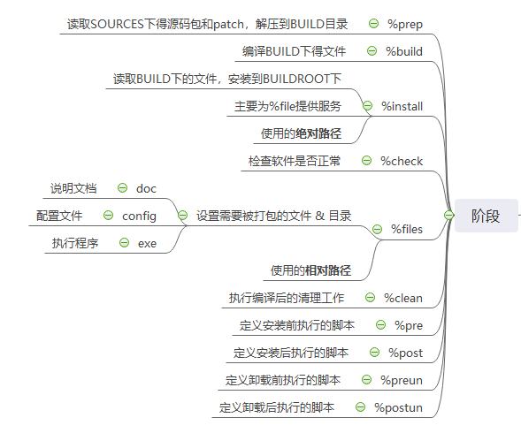
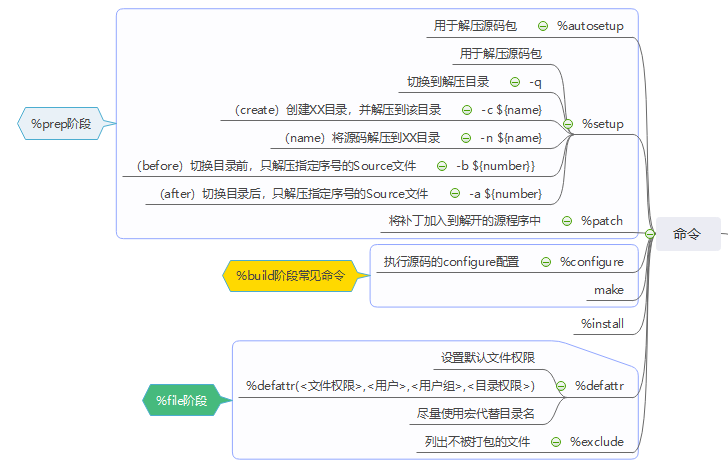

# spec 文件
## 一、简介
spec 文件用于制作 rpm 软件包, 使用 rpm-build 命令进行编译。


rpmbuild 目录规划


## 二、语法
### 2.1 头部

可使用 rpm 命令查看某 rpm 包头信息
```shell
$ rpm -qpi openjdk.rpm
```

### 2.2 主体
可使用 rpm 命令查看某 rpm 包的主体内容
```
$ rpm --scripts -qp openjdk.rpm
```

脚本主体可以包括以下内容


各阶段常见命令如下：

